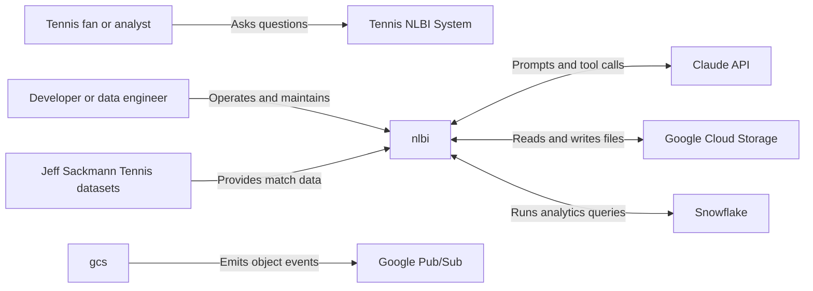

```mermaid

flowchart LR

fan\[Tennis fan or analyst] -->|Asks questions| nlbi\[Tennis NLBI System]
engineer\[Developer or data engineer] -->|Operates and maintains| nlbi

data\[Jeff Sackmann Tennis datasets] -->|Provides match data| nlbi
nlbi <--> |Prompts and tool calls| claude\[Claude API]
nlbi <--> |Reads and writes files| gcs\[Google Cloud Storage]
gcs -->|Emits object events| pubsub\[Google Pub/Sub]
nlbi <--> |Runs analytics queries| snowflake\[Snowflake]

```

