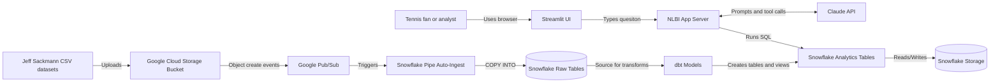

```mermaid
---
config:
  layout: dagre
---
flowchart LR
    fan["Tennis fan or analyst"] -- Uses browser --> ui["Streamlit UI"]
    ui -- Types quesiton --> app["NLBI App Server"]
    app <-- Prompts and tool calls --> llm["Claude API"]
    app -- Runs SQL --> wh["Snowflake Analytics Tables"]
    wh -- Reads/Writes --> db[("Snowflake Storage")]
    dbt["dbt Models"] -- Creates tables and views --> wh
    source["Jeff Sackmann CSV datasets"] -- Uploads --> gcs["Google Cloud Storage Bucket"]
    gcs -- Object create events --> pubsub["Google Pub/Sub"]
    pubsub -- Triggers --> pipe["Snowflake Pipe Auto-Ingest"]
    pipe -- COPY INTO --> raw[("Snowflake Raw Tables")]
    raw -- Source for transforms --> dbt
```