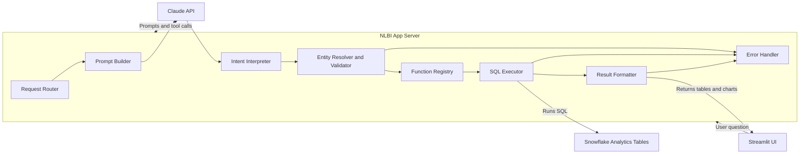

```mermaid
---
config:
  layout: fixed
---
flowchart LR
 subgraph app["NLBI App Server"]
        router["Request Router"]
        prompt["Prompt Builder"]
        intent["Intent Interpreter"]
        validate["Entity Resolver and Validator"]
        tools["Function Registry"]
        exec["SQL Executor"]
        format["Result Formatter"]
        errors["Error Handler"]
  end
    ui["Streamlit UI"] -- User question --> app
    app <-- Prompts and tool calls --> llm["Claude API"]
    exec -- Runs SQL --> wh["Snowflake Analytics Tables"]
    format -- Returns tables and charts --> ui
    router --> prompt
    prompt --> llm
    llm --> intent
    intent --> validate
    validate --> tools & errors
    tools --> exec
    exec --> format & errors
    format --> errors

```