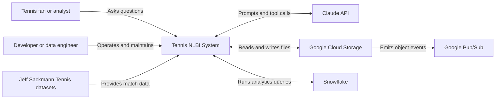
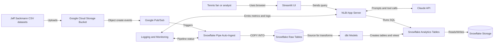
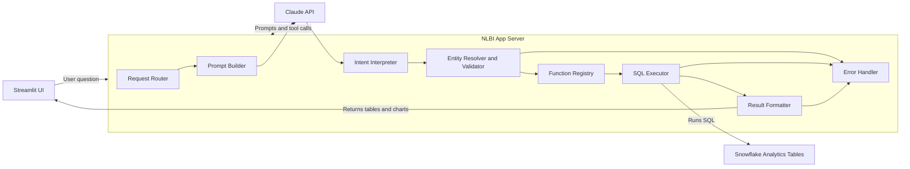

# Architecture Overview

## 1. Purpose and Scope

**System name**  
Tennis Natural Language BI (NLBI) System.

**Purpose**  
An AI-powered analytics system that allows tennis fans, analysts, and curious users to ask natural language questions about ATP and WTA match data and receive accurate, data-driven answers with tables and visualizations.

**In scope**  
- Event-driven ingestion of Jeff Sackmann ATP/WTA CSV datasets into Snowflake  
- dbt transformations producing curated analytics tables  
- A conversational Streamlit application that interprets user intent, executes SQL, and visualizes results

**Out of scope**  
- Live, real-time match data from ongoing tournaments  
- Official ATP/WTA data feeds or commercial use cases  
- User authentication or multi-tenant access control

**Success metrics**  
- Query success rate above 90% for supported question types  
- Median query latency under 3 seconds  
- Data freshness within 24 hours of new files landing in GCS  
- Clear onboarding for new contributors via documentation

---
## 2. System Context (C4 Level 1)



**Actors and external systems**  
- **Tennis fan or analyst** asks natural language questions and receives visual insights.  
- **Developer or data engineer** maintains pipelines, dbt models, and the application.  
- **Jeff Sackmann datasets** are the authoritative historical data source.  
- **Claude (Anthropic)** interprets intent and selects functions.  
- **Google Cloud Storage** stores raw CSV files with versioning.  
- **Google Pub/Sub** signals new file arrivals.  
- **Snowflake** stores raw, staging, and analytics tables and executes all calculations.

---
## 3. High-Level Architecture (C4 Level 2)



**Containers**

| Container | Type | Responsibility | Key dependencies |
|---|---|---|---|
| Streamlit UI | Container | Collects user questions and renders tables and charts | NLBI App Server |
| NLBI App Server | Container | Orchestrates LLM calls, validation, and SQL execution | Claude, Snowflake |
| Snowflake Warehouse | Data store | Stores raw, staging, and curated analytics tables | Snowpipe, dbt |
| Google Cloud Storage | Storage | Raw CSV landing zone with versioning | Pub/Sub |
| Google Pub/Sub | Messaging | Notifies Snowflake of new files | GCS |
| Snowflake Pipe | Ingestion | Auto-loads raw data into Snowflake | Pub/Sub |
| Observability Stack | Platform | Logs, metrics, and pipeline health | App, Snowpipe |

---
## 4. Key Data Flows

**Flow A, Data ingestion (event-driven)**  
1) New CSV lands in GCS.  
2) Pub/Sub emits an object-created event.  
3) Snowflake Pipe triggers auto-ingest into raw tables.  
4) dbt builds staging and analytics models.

**Flow B, User query (real-time)**  
1) User asks a question in Streamlit.  
2) App sends prompt and available tools to Claude.  
3) Claude selects a function with structured parameters.  
4) App validates parameters and runs SQL in Snowflake.  
5) Results are formatted and returned to the UI with charts.

---
## 5. Component View for the NLBI App (C4 Level 3)



**Component responsibilities**

| Component | Responsibility |
|---|---|
| Request Router | Manages session and request lifecycle |
| Prompt Builder | Assembles system prompt and tool schema |
| Intent Interpreter | Maps question to an analysis task |
| Entity Resolver | Normalizes player names, dates, tournaments |
| Function Registry | Defines callable analytics functions |
| SQL Executor | Runs parameterized queries in Snowflake |
| Result Formatter | Shapes outputs for tables and charts |
| Error Handler | Manages ambiguity, empty results, and fallbacks |

---
## 6. Core Data Objects

- **Match**. A tennis match with players, score, surface, tournament, and date.  
- **Player**. Normalized identity used consistently across datasets.  
- **Tournament**. Event metadata including level and surface.  
- **Query**. Structured representation of a user’s natural language question.

---
## 7. Key Integrations

| System | Why we need it | What breaks if it is down | Mitigations |
|---|---|---|---|
| Snowflake | Serves all analytics queries | All queries fail | Retries, graceful degradation, cached examples |
| Claude | Interprets user intent | No function selection | Fallback prompts, simpler heuristics |
| Google Cloud Storage | Stores raw data | Ingestion stops | Manual uploads, local staging |

---
## 8. Risks, Constraints, and Trade-offs

- LLM variability in intent interpretation can cause incorrect function selection.  
- Dependence on Snowflake query latency for user experience.  
- Data freshness depends on file arrival and ingestion timing.  
- Ambiguous player names require careful validation and normalization.

---
## 9. Operational Considerations

**Monitoring and observability**  
- Track query success rate, p50/p95 latency, and ingestion lag.  
- Centralized application and pipeline logs.

**Deployments and releases**  
- Streamlit app deployed via GitHub Actions or cloud hosting.  
- Rollbacks via prior image or code commit.

**Incidents and postmortems**  
- Incidents documented in `/docs/architecture/adr/` or issues.  
- Lessons learned feed back into this document.

---
## 10. Architecture Decisions (ADR Index)

- **ADR-001**. Use function calling over RAG for analytics queries.  
- **ADR-002**. Event-driven ingestion with GCS, Pub/Sub, and Snowpipe.  
- **ADR-003**. Streamlit as UI for rapid iteration.

---
## 11. Glossary

- **NLBI**. Natural Language Business Intelligence.  
- **Snowpipe**. Snowflake’s auto-ingest mechanism.  
- **dbt**. Data build tool for transformations.

---
## Suggested folder structure

```
/docs
  /architecture
    overview.md
    /c4
      01-context.md
      02-containers.md
      03-components-nlbi-app.md
    /adr
      ADR-001-function-calling.md
      ADR-002-snowpipe-ingestion.md
```

